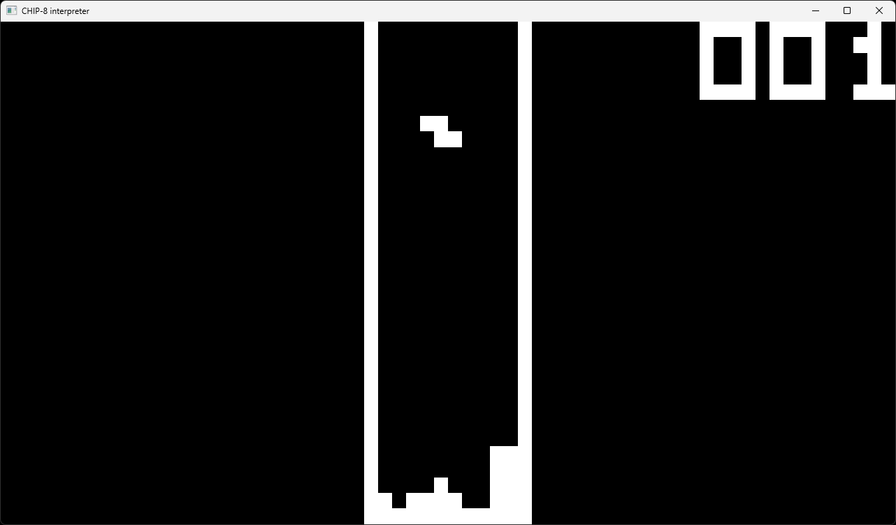
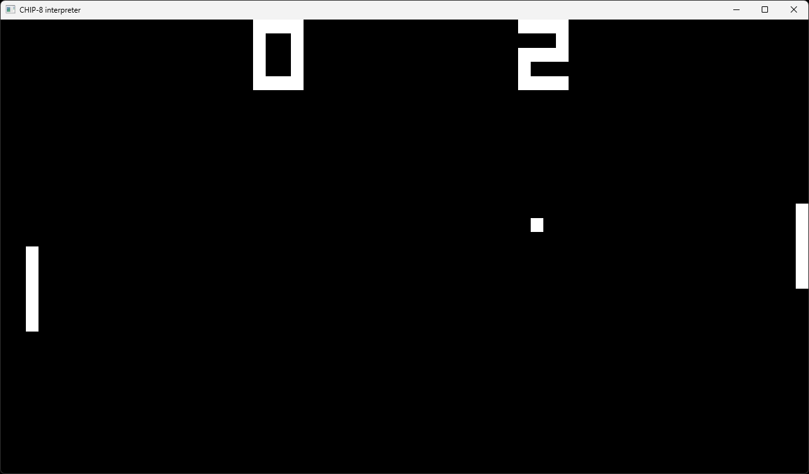
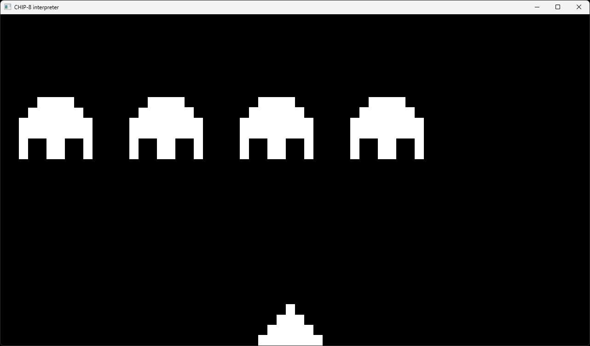
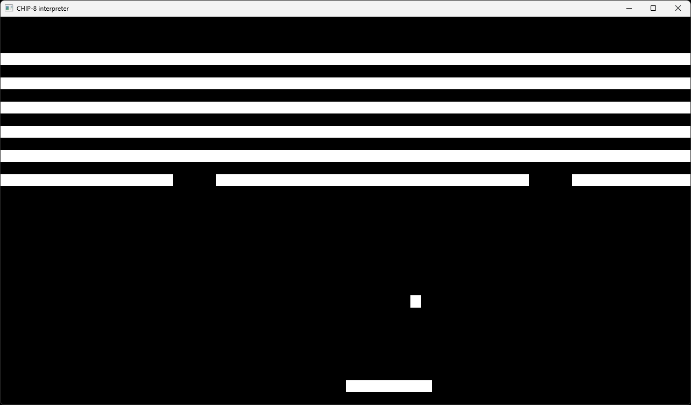

# chip8-c

A CHIP-8 interpreter written in C, using OpenGL and GLFW for cross-platform rendering, window creation, and input handling.


## Screenshots


*Tetris*

<br>


*Pong*

<br>


*Space Invaders*

<br>


*Breakout*

<br>


## Installation, compilation, and execution

⚠️ **Windows Users:** You need `gcc`, `make`, and other basic GNU tools (like `mkdir` and `rm`) to be able to compile the source files using `make`.  
Install them easily using [MSYS2](https://www.msys2.org/).


### Steps

Install and compile with
```bash
git clone https://github.com/GitHubUser82/chip8-c
cd chip8-c
make PLATFORM   # replace PLATFORM with windows or linux 
```
Then use the produced executable to run a CHIP-8 ROM with
```bash
.\bin\chip8_interpreter.exe .\roms\ROM_NAME   # on Windows
./bin/chip8_interpreter.out ./roms/ROM_NAME   # on Linux
```
(Replace **ROM_NAME** with the name of the ROM you want to run)


## Input

The original computer for which CHIP-8 was built (the COSMAC VIP) had a hexadecimal keypad that looked like this:

```
1 2 3 C
4 5 6 D
7 8 9 E
A 0 B F
```

Modern CHIP-8 interpreters use the 16 keys in the upper-left section of a standard keyboard to emulate the original hexadecimal keypad.

For a QWERTY keyboard, these are:
```
1 2 3 4
Q W E R
A S D F
Z X C V
```

For an AZERTY keyboard, these are:

```
1 2 3 4
A Z E R
Q S D F
W X C V
```
